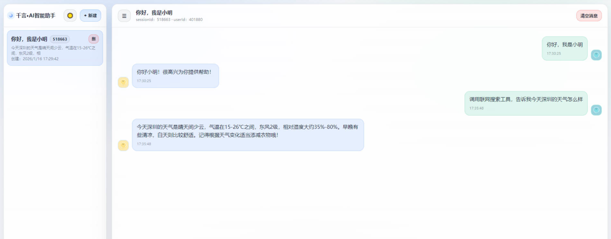
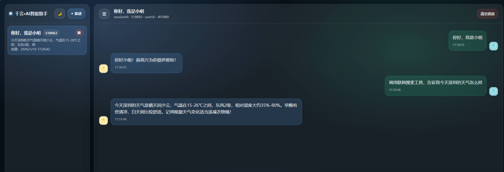
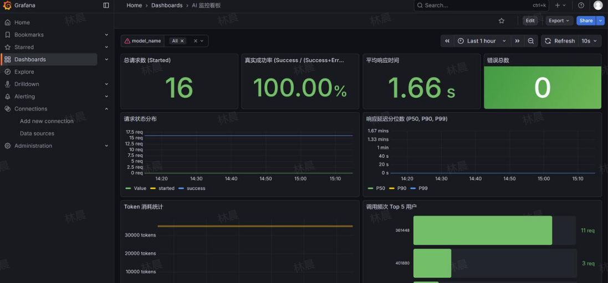

# LangChain4j-agent

## 项目概览

基于 **Java + Spring Boot + LangChain4j** 构建的企业级智能 Agent 系统，通过深度整合 **RAG、MCP 协议、分布式记忆与工具调用能力**，构建具备 **感知、记忆、规划、行动** 四大核心能力的智能体。

**技术栈：**
Spring Boot 3.5.9 ｜ JDK 17 ｜ LangChain4j 1.1.0 ｜ Alibaba Qwen ｜ PgVector ｜ Redis 8.4.0 ｜ Prometheus + Grafana ｜ Docker

---

## 核心能力

### 🔍 RAG 检索增强生成系统设计与优化

* 采用 **text-embedding-v4 模型** 对企业私有文档进行语义向量化，存储至 **PgVector 向量数据库**，实现私有知识精准检索
* 实现递归文档切分策略（chunk 500 字符、重叠 150 字符），保证语义完整性，召回准确率提升 **10%~20%**
* 设计查询预处理器（停用词过滤 + 文本规范化），提升模糊查询召回率 **20%~30%**
* 实现 **Rerank 重排序机制**（粗排 20 条 + 精排 5 条），确保最相关结果优先返回
* 开发 **RagAutoReloadJob 定时任务**，每 5 分钟自动扫描文档目录并加载新增/修改文档，实现知识库动态更新

---

### 🧠 分布式会话记忆系统架构设计

* 基于 **Redis** 构建分布式会话记忆，通过 MemoryId 实现多用户、多实例隔离
* 实现记忆压缩策略（TokenCountChatMemoryCompressor）：

  * 滑动窗口保留最近 5 轮完整对话（约 2000 tokens）
  * 历史对话压缩为摘要
* 消息数超过 20 条自动触发压缩，Token 消耗降低约 **60%**，同时保证对话连贯性
* 结合 Redis TTL 实现记忆生命周期管理，支持长程多轮上下文

---

### 🛠️ 智能工具调用与 MCP 协议集成

* 基于 LangChain4j **Function Calling**，通过 `@Tool` 注解定义方法 Schema，实现自然语言到业务逻辑映射
* 集成 **MCP（Model Context Protocol）**，标准化模型与工具交互
* 支持多工具调用：

  * 联网搜索
  * 邮件发送
  * 天气查询
* 支持动态扩展 RAG 知识库：用户可通过对话反向写入知识，实现知识库自生长

---

### 🔐 全链路安全防护与可观测性体系

* 基于 LangChain4j **Guardrail** 构建双层防护：

  * 输入层：敏感词过滤、Prompt 注入检测
  * 输出层：内容合规性审核
* 集成 **Prometheus + Grafana** 构建可观测体系，监控指标包括：

  * Token 消耗量
  * 模型调用频次
  * 检索命中率
  * 工具调用成功率
* 构建用户与会话排行榜，支持精细化运营与资源调度
* 通过监控面板实时发现异常，缩短故障排查时间

---

### ⚡ 流式输出与前端交互优化

* 支持 **qwen-max 流式对话模型**
* 基于 **SSE（Server-Sent Events）** 实现前后端流式通信
* 对话结果实时分段返回，用户感知响应速度提升 **50%+**

---


## 项目预览





## 项目核心定位

以企业级生产环境为基准，打造 “知识可进化、记忆可持久、行动可落地、运行可监控” 的全链路智能 Agent 解决方案，实现私有知识的精准利用、业务流程的自动化执行、多用户会话的隔离管理，同时通过安全防护与可观测性体系，保障系统在企业场景下的稳定性与合规性。

## 核心技术栈

| 技术维度   | 核心选型               | 版本           | 核心价值                                                     |
| :--------- | :--------------------- | :------------- | :----------------------------------------------------------- |
| 核心框架   | Spring Boot            | 3.5.9          | 快速构建企业级应用，实现依赖注入、自动配置与接口标准化       |
| 开发环境   | JDK                    | 17             | 支撑模块化开发，兼容 LangChain4j 等框架的新特性依赖          |
| 大模型应用 | LangChain4j            | 1.1.0          | 封装 RAG、Agent 调度、工具调用与安全防护能力，降低大模型应用开发门槛 |
| 大语言模型 | Alibaba Qwen           | -              | 提供核心对话推理、逻辑规划与业务指令解析能力                 |
| 向量检索   | PgVector（PostgreSQL） | 15.15          | 构建私有知识向量库，实现文档语义的高精度检索与匹配           |
| 嵌入模型   | text-embedding-v4      | -              | 将自然语言 / 文档转化为高维向量，支撑 PgVector 检索的核心基础 |
| 分布式记忆 | Redis                  | 8.4.0          | 存储多用户会话记忆，实现会话隔离与持久化，支持记忆生命周期管理 |
| 容器化部署 | Docker                 | -              | 实现项目环境标准化，简化部署与跨环境迁移流程                 |
| 可观测性   | Prometheus + Grafana   | 3.7.3 + 12.3.0 | 采集核心运行指标，可视化监控系统状态，支撑问题定位与性能优化 |
| 协议与规范 | MCP 协议               | -              | 标准化模型与工具的交互方式，实现多工具的灵活集成与调用       |

## 核心功能与技术实现

### 1. RAG 动态知识植入引擎（核心能力）

针对大语言模型 “幻觉” 与 “知识时效性差” 的痛点，构建全链路私有知识检索体系：

- 向量检索构建：采用 text-embedding-v4 模型对企业私有文档进行语义切片与高维向量化，存储至 PgVector 向量库，实现私有领域知识的精准检索；
- 动态知识自进化：支持用户通过自然语言指令，将实时新知识反向同步至文档与向量库，无需人工干预、无需重启服务，即可完成私有知识库的动态更新，实现智能体的 “知识自生长”。

### 2. 分布式会话记忆与隔离

基于 Redis 构建高可用的分布式记忆系统，适配企业多用户并发场景：

- 会话隔离机制：通过 MemoryId 唯一标识用户会话，实现多用户、多实例下的会话状态逻辑隔离，避免会话数据混淆；
- 记忆生命周期管理：结合 Redis TTL 策略，自动化管理会话记忆的存储成本，同时支持长程多轮对话，保留用户历史交互上下文。

### 3. 智能任务编排与工具调用

基于 LangChain4j Function Calling 与 MCP 协议，赋予 Agent 实际业务行动能力：

- 多工具集成：支持联网搜索、智能邮件发送、查天气等常用工具，可快速扩展至企业内部业务系统（如 OA、CRM）；
- 精准指令转换：通过 @Tool 注解定义方法 Schema，结合 Prompt 工程实践，实现自然语言到业务逻辑的精准转换，确保工具调用的准确性。

### 4. 全链路安全防护机制

基于 LangChain4j Guardrail 构建合规拦截体系，保障企业级应用的安全性与合规性：

- 输入层防护：设置自定义规则，实现敏感词过滤、Prompt 注入检测，有效拒绝违法、违规输入；
- 输出层校验：对 Agent 生成结果进行合规性审核，避免泄露企业私有信息或输出不当内容。

### 5. 全链路可观测性监控

集成 Prometheus + Grafana 打造可视化监控体系，覆盖 Agent 全生命周期运行指标：

- 核心指标采集：监控 Token 消耗量、模型调用频次、检索命中率、工具调用成功率等关键指标；
- 运营级可视化：构建 Top 用户与会话排行榜，为系统优化、资源调配与精细化运营提供数据支撑；
- 问题快速定位：通过监控面板实时发现异常（如模型调用超时、检索失败），缩短故障排查时间。

### 6. 流式输出交互优化

支持 qwen-max 流式对话模型，实现对话结果的实时分段返回，提升用户交互体验，避免长文本回复的等待延迟。

# 核心技术架构图

## 一、整体架构分层

```
┌─────────────────────────────────────────────────────────────────┐
│                        接入层 (Controller)                        │
│                     AiChatController (REST API)                  │
└─────────────────────────────────────────────────────────────────┘
                              ↓
┌─────────────────────────────────────────────────────────────────┐
│                      安全防护层 (Guardrail)                       │
│              SafeInputGuardrail (输入层敏感词过滤)                │
└─────────────────────────────────────────────────────────────────┘
                              ↓
┌─────────────────────────────────────────────────────────────────┐
│                      核心服务层 (AiServices)                      │
│                    AiChat Interface (AI 对话接口)                │
│                  - chat() 同步对话                               │
│                  - streamChat() 流式对话                         │
└─────────────────────────────────────────────────────────────────┘
                              ↓
        ┌─────────────────────┼─────────────────────┐
        ↓                     ↓                     ↓
┌──────────────┐    ┌──────────────┐      ┌──────────────┐
│  大模型层     │    │  记忆层       │      │  工具层       │
│ (LLM Model)  │    │ (Memory)     │      │ (Tools)      │
└──────────────┘    └──────────────┘      └──────────────┘
        ↓                     ↓                     ↓
┌──────────────┐    ┌──────────────┐      ┌──────────────┐
│ Qwen Model   │    │ Redis Store  │      │ MCP Tools    │
│ - 同步模型    │    │ - 会话隔离    │      │ - 联网搜索    │
│ - 流式模型    │    │ - 记忆压缩    │      │ - 天气查询    │
└──────────────┘    └──────────────┘      │ Custom Tools │
                                          │ - 邮件发送    │
                                          │ - RAG 工具   │
                                          │ - 时间工具    │
                                          └──────────────┘
                              ↓
┌─────────────────────────────────────────────────────────────────┐
│                      知识检索层 (RAG)                             │
│                   ContentRetriever (检索器)                       │
└─────────────────────────────────────────────────────────────────┘
                              ↓
        ┌─────────────────────┼─────────────────────┐
        ↓                     ↓                     ↓
┌──────────────┐    ┌──────────────┐      ┌──────────────┐
│ 查询预处理    │    │  向量检索     │      │  重排序       │
│QueryPreproc  │    │ PgVector     │      │ QwenRerank   │
│- 停用词过滤   │    │- Embedding   │      │- 粗排 Top20  │
│- 文本规范化   │    │- 语义匹配     │      │- 精排 Top5   │
└──────────────┘    └──────────────┘      └──────────────┘
```

---

## 二、核心模块依赖关系

### 1. 配置层 (Config)
```
DashScopeModelConfig ──> ChatModel + StreamingChatModel
                         (Qwen 大模型配置)

EmbeddingStoreConfig ──> EmbeddingModel + PgVector
                         (向量模型 + 向量数据库)

RagConfig ──> ContentRetriever
              ├─> EmbeddingStoreIngestor (文档切分 + 向量化)
              │   └─> RecursiveDocumentSplitter (递归切分器)
              └─> ReRankingContentRetriever (重排序检索器)
                  ├─> QueryPreprocessor (查询预处理)
                  └─> QwenRerankClient (Qwen 重排序)

ChatMemoryConfig ──> TokenCountChatMemoryCompressor
                     (记忆压缩器配置)

RedisChatMemoryStoreConfig ──> RedisChatMemoryStore
                                (Redis 记忆存储)

McpToolConfig ──> McpToolProvider
                  (MCP 工具提供者)
```

### 2. 服务组装层 (AiChatService)
```
AiChatService.aiChat() Bean 组装:
    │
    ├─> ChatModel (同步对话模型)
    ├─> StreamingChatModel (流式对话模型)
    ├─> ContentRetriever (RAG 检索器)
    ├─> ChatMemoryProvider (记忆提供者)
    │   └─> CompressibleChatMemory (可压缩记忆)
    │       ├─> RedisChatMemoryStore (Redis 存储)
    │       ├─> TokenCountChatMemoryCompressor (压缩器)
    │       └─> RedisTemplate (分布式锁)
    ├─> Tools (工具集)
    │   ├─> TimeTool (时间工具)
    │   ├─> RagTool (RAG 动态更新工具)
    │   └─> EmailTool (邮件工具)
    └─> McpToolProvider (MCP 工具提供者)
```

### 3. 记忆管理模块
```
CompressibleChatMemory (可压缩记忆实现)
    │
    ├─> RedisChatMemoryStore (持久化存储)
    │   └─> Redis (分布式存储)
    │
    ├─> TokenCountChatMemoryCompressor (压缩策略)
    │   ├─> 滑动窗口: 保留最近 5 轮对话
    │   ├─> 历史摘要: 压缩早期对话
    │   └─> 自动触发: 消息数 > 20 条
    │
    └─> 分布式锁机制
        └─> RedisTemplate (防止并发压缩冲突)
```

### 4. RAG 检索模块
```
ContentRetriever (检索器总入口)
    │
    └─> ReRankingContentRetriever (重排序检索器)
        │
        ├─> QueryPreprocessor (查询预处理)
        │   ├─> 停用词过滤
        │   ├─> 标点符号清理
        │   └─> 空格规范化
        │
        ├─> EmbeddingStoreContentRetriever (向量检索)
        │   ├─> EmbeddingModel (text-embedding-v4)
        │   ├─> PgVector (向量数据库)
        │   ├─> maxResults: 20 (粗排)
        │   └─> minScore: 0.65 (相似度阈值)
        │
        └─> QwenRerankClient (精排)
            └─> finalTopN: 5 (最终返回 Top5)
```

### 5. 文档处理模块
```
EmbeddingStoreIngestor (文档摄取器)
    │
    ├─> RecursiveDocumentSplitter (递归切分器)
    │   ├─> maxChunkSize: 500 字符
    │   ├─> chunkOverlap: 150 字符
    │   └─> 递归切分策略 (保证语义完整性)
    │
    ├─> TextSegmentTransformer (文本转换)
    │   └─> 添加文件名元数据
    │
    ├─> EmbeddingModel (向量化)
    │   └─> text-embedding-v4
    │
    └─> EmbeddingStore (存储)
        └─> PgVector
```

### 6. 工具调用模块
```
Tools (工具集成)
    │
    ├─> TimeTool (时间工具)
    │   └─> @Tool 注解标记
    │
    ├─> RagTool (RAG 动态更新工具)
    │   ├─> 动态添加文档到向量库
    │   └─> 实现知识库自生长
    │
    ├─> EmailTool (邮件工具)
    │   └─> 智能邮件发送
    │
    └─> McpToolProvider (MCP 工具)
        ├─> 联网搜索
        └─> 天气查询
```

---

## 三、数据流转路径

### 1. 用户对话流程
```
用户请求
    ↓
AiChatController (接收 HTTP 请求)
    ↓
SafeInputGuardrail (输入安全检查)
    ↓
AiChat.chat() / streamChat()
    ↓
┌─────────────────────────────────────┐
│ AiServices 核心编排                  │
│                                     │
│ 1. 从 Redis 加载历史记忆              │
│    └─> CompressibleChatMemory       │
│        └─> 检查是否需要压缩 (>20条)   │
│                                     │
│ 2. RAG 检索相关知识                  │
│    └─> ContentRetriever             │
│        ├─> 查询预处理                │
│        ├─> 向量检索 (Top20)          │
│        └─> Rerank 精排 (Top5)       │
│                                     │
│ 3. 构建完整 Prompt                   │
│    ├─> System Message               │
│    ├─> 历史对话记忆                  │
│    ├─> RAG 检索结果                  │
│    └─> 用户当前输入                  │
│                                     │
│ 4. 调用大模型推理                    │
│    └─> Qwen Model                   │
│        └─> 判断是否需要工具调用       │
│                                     │
│ 5. 工具调用 (如需要)                 │
│    └─> Function Calling             │
│        └─> 执行对应工具并返回结果     │
│                                     │
│ 6. 保存对话到 Redis                  │
│    └─> CompressibleChatMemory       │
│                                     │
└─────────────────────────────────────┘
    ↓
返回响应 (同步 / 流式)
```

### 2. RAG 文档加载流程
```
RagAutoReloadJob (定时任务，每 5 分钟)
    ↓
扫描文档目录 (递归)
    ↓
检测新增/修改文档 (基于文件修改时间)
    ↓
EmbeddingStoreIngestor
    ↓
RecursiveDocumentSplitter (递归切分)
    ├─> Chunk Size: 500 字符
    └─> Overlap: 150 字符
    ↓
EmbeddingModel (向量化)
    └─> text-embedding-v4
    ↓
PgVector (存储向量)
    └─> 支持语义检索
```

### 3. 记忆压缩流程
```
用户对话 (消息数累积)
    ↓
CompressibleChatMemory.add()
    ↓
检查消息数 > maxMessages (20条)
    ↓
获取分布式锁 (Redis)
    ↓
TokenCountChatMemoryCompressor.compress()
    ├─> 保留最近 5 轮对话 (约 2000 tokens)
    ├─> 压缩早期对话为摘要 (前 50 字符)
    └─> 组装: [摘要] + [最近对话]
    ↓
存储回 Redis
    ↓
释放分布式锁
```

---

## 四、核心技术依赖关系图

```
┌─────────────────────────────────────────────────────────────────┐
│                         Spring Boot 3.5.9                        │
│                         (应用框架基座)                            │
└─────────────────────────────────────────────────────────────────┘
                              ↓
        ┌─────────────────────┼─────────────────────┐
        ↓                     ↓                     ↓
┌──────────────┐    ┌──────────────┐      ┌──────────────┐
│ LangChain4j  │    │   Redis      │      │  PostgreSQL  │
│   1.1.0      │    │   8.4.0      │      │  + PgVector  │
│              │    │              │      │              │
│ - AiServices │    │ - 会话存储    │      │ - 向量存储    │
│ - RAG        │    │ - 分布式锁    │      │ - 语义检索    │
│ - Guardrail  │    │ - TTL 管理   │      │              │
│ - MCP        │    │              │      │              │
└──────────────┘    └──────────────┘      └──────────────┘
        ↓                                          ↓
┌──────────────┐                          ┌──────────────┐
│ Alibaba Qwen │                          │  Embedding   │
│              │                          │   Model      │
│ - 对话模型    │                          │ text-embed-  │
│ - 流式模型    │                          │ ding-v4      │
│ - Rerank模型 │                          │              │
└──────────────┘                          └──────────────┘
```

---

## 五、监控与可观测性

```
┌─────────────────────────────────────────────────────────────────┐
│                      Prometheus + Grafana                        │
│                      (监控可视化体系)                             │
└─────────────────────────────────────────────────────────────────┘
                              ↑
                    采集核心运行指标
                              ↑
        ┌─────────────────────┼─────────────────────┐
        ↓                     ↓                     ↓
┌──────────────┐    ┌──────────────┐      ┌──────────────┐
│ Token 消耗   │    │ 模型调用频次  │      │ 检索命中率    │
└──────────────┘    └──────────────┘      └──────────────┘
        ↓                     ↓                     ↓
┌──────────────┐    ┌──────────────┐      ┌──────────────┐
│工具调用成功率 │    │ Top 用户排行 │      │ 会话排行榜    │
└──────────────┘    └──────────────┘      └──────────────┘
```

---

## 六、关键技术特性总结

### 1. 分布式架构
- Redis 实现会话隔离与分布式锁
- 支持多实例部署，无状态服务设计

### 2. 智能记忆管理
- 滑动窗口 + 历史摘要压缩策略
- Token 消耗降低 60%
- 自动触发压缩机制

### 3. RAG 检索优化
- 查询预处理 (停用词过滤)
- 递归文档切分 (500/150)
- 粗排 (Top20) + 精排 (Top5)
- 召回准确率提升 20-30%

### 4. 动态知识更新
- RagAutoReloadJob 定时扫描
- RagTool 支持对话式更新
- 无需重启服务

### 5. 安全防护
- 输入层 Guardrail (敏感词过滤)
- 输出层合规性审核
- Prompt 注入检测

### 6. 工具生态
- LangChain4j Function Calling
- MCP 协议标准化集成
- 自定义工具扩展能力

